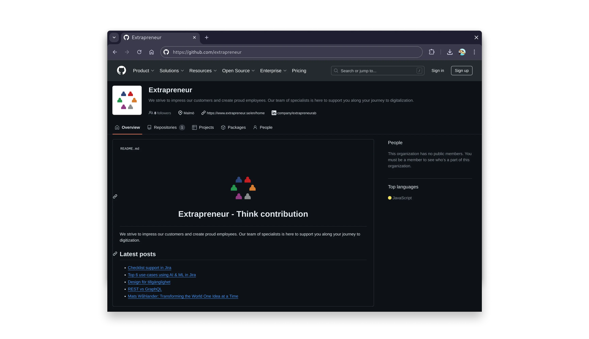

# .github

[](https://conventionalcommits.org)
[](https://github.com/semantic-release/semantic-release)
[](https://github.com/extrapreneur/.github/actions/workflows/release.yml)

A simple node js application that scrapes an element and a list of urls, then replaces sections in [profile/README.md](./profile/README.md).

<center>
  
</center>

## Prerequisites

- [Node JS](https://nodejs.org/en/download/package-manager)

## Install

1. Clone repository

```bash
gh repo clone extrapreneur/.github
```

1. Navigate to directory

```bash
cd .github/
```

1. Install dependencies

```bash
npm install
```

## Usage

1. Start application

```bash
npm run start
```
